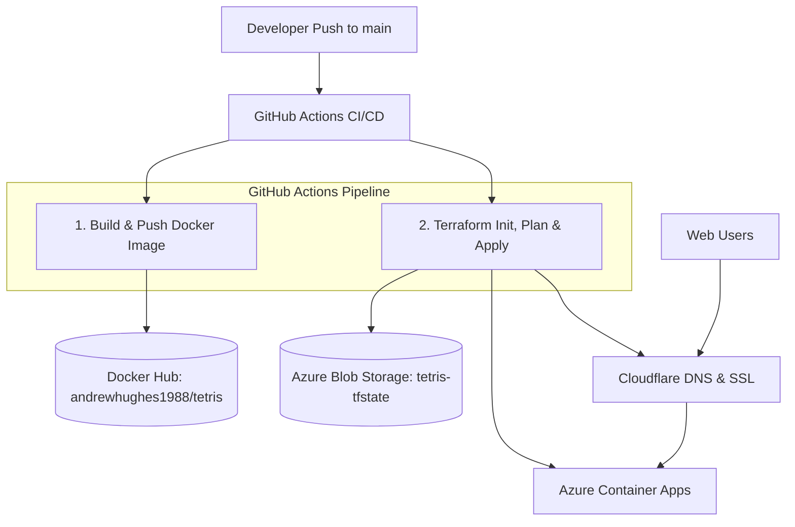

# 🎮 Tetris App - Infrastructure as Code & CI/CD Pipeline

A modern, containerized Tetris web application deployed on **Azure Container Apps** with custom domain SSL via **Cloudflare DNS**, managed using **Terraform** and automated through **GitHub Actions**.

---

## 🏗️ Architecture Overview



---

## 🚀 Tech Stack

- **Frontend Application**: Pure HTML5 & JavaScript (Nginx alpine container base)
- **Container Registry**: Docker Hub (`andrewhughes1988/tetris:1.0`)
- **Infrastructure as Code**: Terraform (AzureRM & Cloudflare providers)
- **Remote State**: Azure Blob Storage (`STORAGE/netsysprep/tetris-tfstate`)
- **Cloud Hosting**: Azure Container Apps (ACA) & Log Analytics
- **DNS & Managed SSL**: Cloudflare DNS + Azure Container App Custom Domain Binding
- **Automation**: GitHub Actions CI/CD pipeline

---

## 📁 Repository Structure

```text
.
├── .github/
│   └── workflows/
│       └── deploy.yml          # GitHub Actions CI/CD workflow
├── terraform/
│   ├── main.tf                 # Azure RG, ACA, Log Analytics & Cloudflare resources
│   ├── providers.tf            # Azure & Cloudflare providers + Azure Blob backend
│   ├── variables.tf            # Input variable declarations
│   ├── outputs.tf              # Output definitions (App FQDN, RG name, etc.)
│   ├── terraform.tfvars        # Default environment configuration
│   └── terraform.tfvars.example# Example variables template
├── Dockerfile                  # Nginx Alpine container definition
├── tetris.html                 # Tetris game source code
├── .gitignore                  # Git ignore rules for Terraform & secrets
└── README.md                   # Repository documentation
```

---

## 🔑 CI/CD GitHub Repository Secrets

To run the automated GitHub Actions pipeline, configure the following secrets in **Settings > Secrets and variables > Actions**:

| Secret | Description |
| :--- | :--- |
| `AZURE_CLIENT_ID` | Azure Service Principal App ID |
| `AZURE_CLIENT_SECRET` | Azure Service Principal Password |
| `AZURE_TENANT_ID` | Azure Directory / Tenant ID |
| `AZURE_SUBSCRIPTION_ID` | Azure Subscription ID |
| `CLOUDFLARE_API_TOKEN` | Cloudflare API token with DNS Edit permissions |
| `DOCKER_USERNAME` | Docker Hub Username (`andrewhughes1988`) |
| `DOCKER_PASSWORD` | Docker Hub Password or Personal Access Token |

---

## 💻 Local Execution

### Run Container Locally with Docker

```bash
docker build -t tetris:local .
docker run -d -p 8080:80 tetris:local
```
Navigate to `http://localhost:8080` in your browser.

### Run Terraform Locally

```bash
cd terraform
terraform init
terraform plan
terraform apply
```
